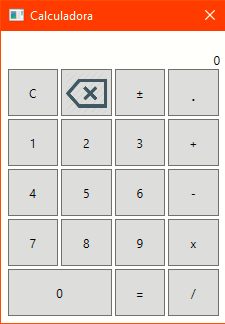

<h1>Calculadora em XAML</h1>

Uma calculadora feita em C#/XAML para o trabalho final da materia de Logica de Programação da ETEC Salim Sedeh

Lembrando que, a complexidade deste projeto não esta sendo exigida. Estou aplicando tudo que sei 
(Que francamente e muito em comparação à materia) neste projeto.

  
<h2>Downloads</h2>
<a href="https://github.com/kabessao/Calculadora/releases/download/v0.0.2/calculadora.exe"> v0.0.2</a>

<h3>Contatos</h3>
E-mail: henrique.silva533@etec.sp.gov.br / soares.henrique495@gmail.com

